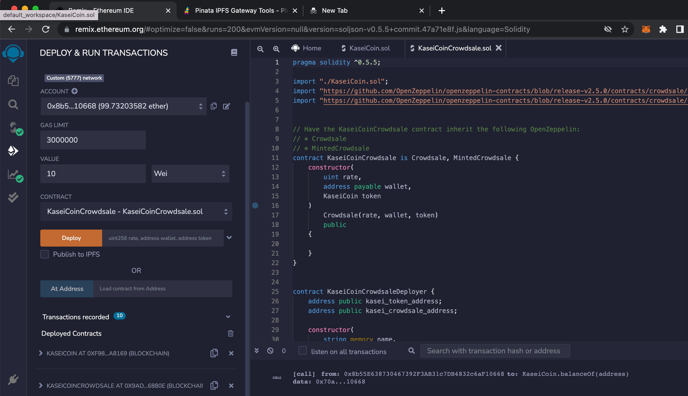
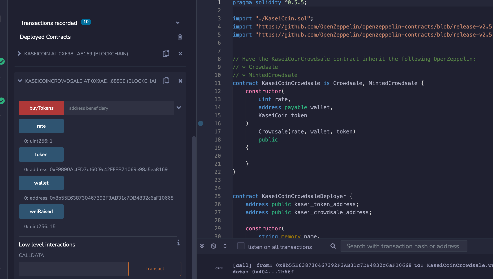
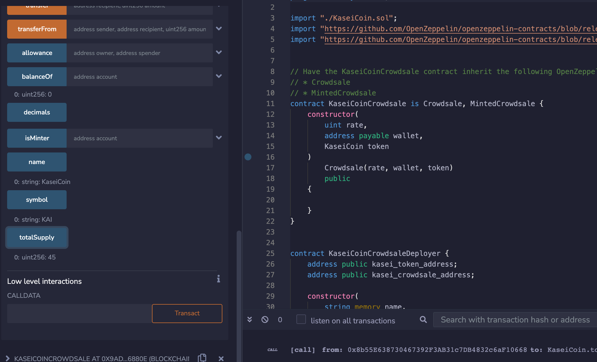

# Challenge 21

## Challenge: Martian Token Crowdsale

This challenge asks to student to create a fungible token that is ERC-20 compliant and that will be minted by using a `Crowdsale` contract from the OpenZeppelin Solidity library.

The crowdsale contract will manage the entire crowdsale process, allowing users to send ether to the contract and in return receive KAI, or KaseiCoin tokens. The contract will mint the tokens automatically and distribute them to buyers in one transaction.

### Instructions

The steps for this Challenge are divided into the following sections:

1. Create the KaseiCoin Token Contract

2. Create the KaseiCoin Crowdsale Contract

3. Create the KaseiCoin Deployer Contract (this is included in the crowdsale solidity file)

4. Deploy the Crowdsale to a Local Blockchain

### The Results

The following video shows: Both KaseiCoin and KaseiCoin Crowdsale contracts compiled and deployed, buying tokens increases total supply and Wei raised, and a successful buy KAI token transaction.

[Results Video](https://github.com/angie0920/Challenge21/blob/main/results/buytokens.mp4)

This is a picture of the deployed and compiled contracts:

This is the total supply and wei raised:

## Conclusion:
The KaseiCoin, Crowdsale, and deployer contracts were successfully deployed. The KaseiCrowdsale contract successfully buys tokens, increasing supply and wei raised.
